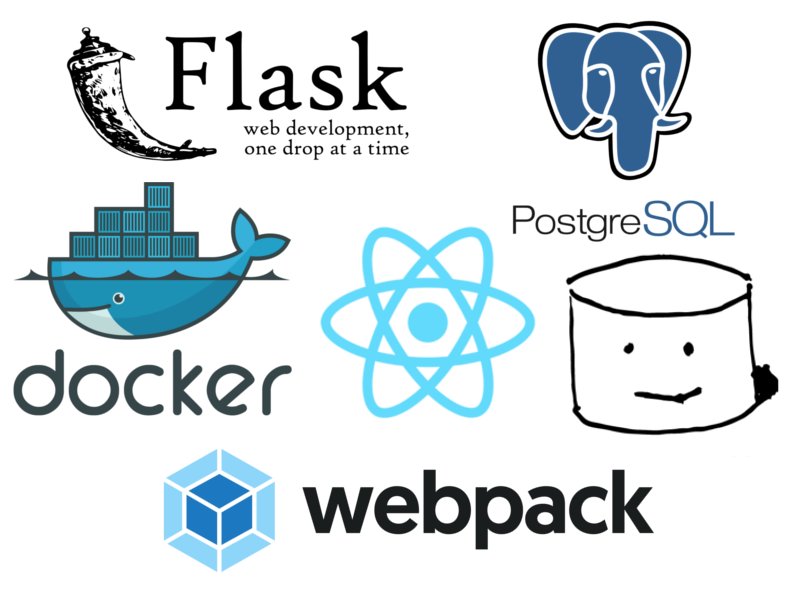

# Compute Cross Product SPA

##### This application uses a React SPA front-end served by webpack-dev-server. The back-end is powered by Flask and PostgreSQL.



# Directions
### *For Docker CE both applications run on and can be accessed at `0.0.0.0:<port>`, if using Docker-Machine, they will run on the IP provided when running `docker-machine ip <machine_name>`*
### *The backend Flask API runs on port `5000` while the front-end webpack-dev-server runs on port `8080`*

## *For Docker-Machine*
#### *Please update the `.env` file with the proper value for the `API_HOST` env variable set under the `client` service. This should be the IP of the Flask backend application. Read above for specific IP information*
#### *P.S. This value defaults is pre-set to `0.0.0.0` so it works out of the box with Docker CE*
# Setup

##Simple Startup (locally)
 
### Flask
- Install pipenv and related package requirements.

	`pip install pipenv`
	
	`pipenv install --python 3.6`
	
- Set Flask entry point in environment variables

    `export FLASK=manage.py`

- Create the database.

	`flask initdb`

- Run the application.

	`flask run`

- Navigate to the displayed IP.

### Webpack server
- Navigate to the `/client/` directory
    
    `cd ~/path/to/application/client/`
    
- Install package dependencies from `package.json` using npm
    
    `npm install`
    
- Run the webpack-dev-server locally (*This runs the server on `127.0.0.1:8080`, but will show as `0.0.0.0:8080` on Windows and on Linux it WILL run on `0.0.0.0:8080`*)

    `npm run start-local`

## Deployment on Docker

The current application can be deployed with Docker [in a few commands](https://realpython.com/blog/python/dockerizing-flask-with-compose-and-machine-from-localhost-to-the-cloud/).

```sh
cd ~/path/to/application/
```
*Start here if you <b>DO</b> use `docker-machine`*
```sh
docker-machine create -d virtualbox --virtualbox-memory 1024 --virtualbox-cpu-count 1 <machine_name>
docker-machine env <machine_name>
eval "$(docker-machine env <machine_name>)"
...
```
*Start here if you <b>DO NOT</b> use `docker-machine`*
```sh
$ sudo docker-compose build
$ sudo docker-compose up -d
$ sudo docker-compose run --rm web flask initdb
```

### If using `docker-machine` you must then access the IP address given by `docker-machine ip <machine_name>` directly from your machine along with the appropriate port to access a given service.

<br>

# Flask CLI Commands

#### `flask initdb`
- Initialize the database
#### `flask dropdb`
- Drop the database
#### `flask refreshdb`
- Drop then reinitialize the database

*All database data is persisted through volumes*


## License

The MIT License (MIT). Please see the [license file](LICENSE) for more information.
